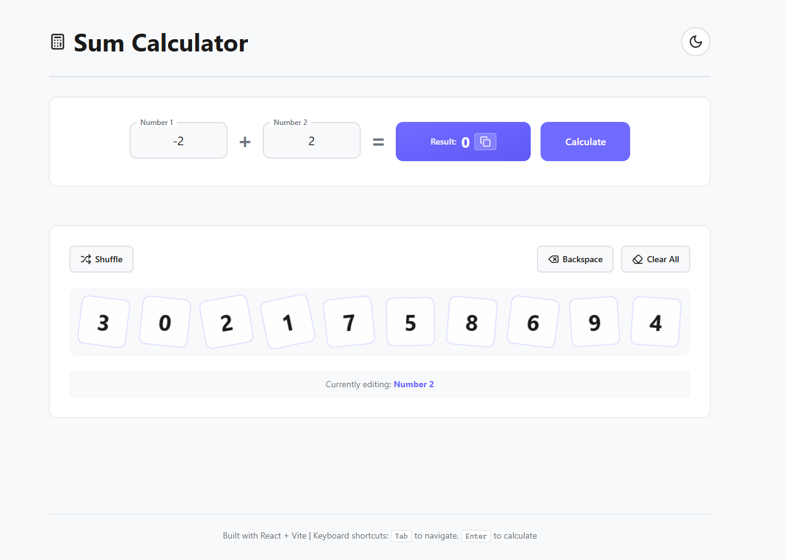
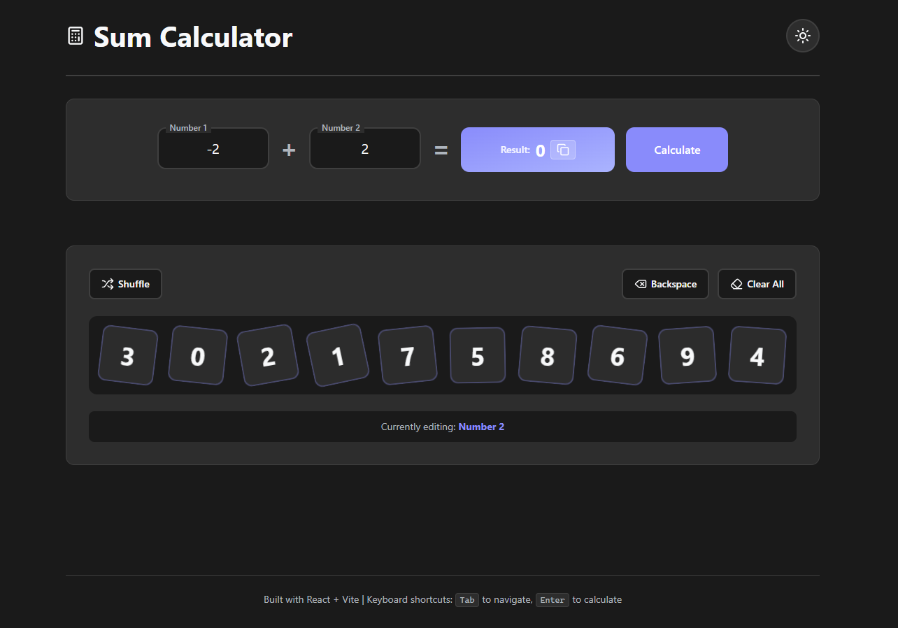

# 🧮 Sum Calculator App

**Demo**: https://ia03-sum-calculator.vercel.app/

<p align="center">
  
  
</p>

## ✨ Tính năng nổi bật

- 🎨 **Giao diện hiện đại, cảm hứng Windows 11**
- 🌗 **Chuyển đổi Dark/Light mode** (tự động và toggle)
- 📱 **Responsive**: tuyệt đẹp trên điện thoại và desktop
- 🔢 **Bàn phím số động**: các thẻ số 0–9 với vị trí & xoay ngẫu nhiên
- ⌨️ **Hỗ trợ bàn phím**: nhập số, Enter để tính tổng; backspace/xóa/tẩy nhanh
- ♿ **Đầy đủ accessibility**: ARIA, tab, live region, focus rõ ràng
- 💡 **Validation realtime cho từng field** (nhưng chỉ tính khi nhấn nút)
- 📋 **Copy kết quả**: 1 click là copy, cả trên mobile

---

## 🚀 Hướng dẫn cài đặt

**Yêu cầu:** Node.js >= 18, npm hoặc yarn

```bash
# Clone về máy
 git clone https://github.com/MinhNguyenCG/ia03-sum-calculator
 cd sum-calculator-app
# Cài dependencies
 npm install
# Chạy local
 npm run dev
```

Mở trình duyệt truy cập `http://localhost:5173`.

### Build production

```
npm run build
npm run preview  # Xem build prod
```

---

## ⚡ Cách dùng

- Nhập số vào input hoặc click các card số bên dưới
- **Backspace**: xóa từng ký tự trong ô đang focus
- **Shuffle**: đổi vị trí & góc các card số (cho vui :)
- **Clear All**: xóa cả hai ô nhập
- **Calculate Sum** (hoặc nhấn Enter): mới tính kết quả
- **Copy**: bấm icon copy bên kết quả

### Bàn phím được hỗ trợ

| Phím        | Chức năng                           |
| ----------- | ----------------------------------- |
| `0-9`, `.`  | Nhập số, thập phân (cho mỗi input)  |
| `Tab`       | Di chuyển tới input kế tiếp/nút     |
| `Enter`     | Tính tổng (giống bấm Calculate Sum) |
| `Backspace` | Xóa 1 ký tự cuối ô nhập đang focus  |

---

## 🏗️ Kiến trúc dự án

```
src/
├── components/
│   ├── SumCalculator.jsx      # Trang máy tính chính
│   ├── EquationStrip.jsx      # Strip inline phép tính + kết quả + nút
│   ├── DigitBoard.jsx         # Grid bàn phím số & nút chức năng
│   ├── DigitCard.jsx          # Card số: số, hiệu ứng, click
│   └── InputField.jsx         # Input custom có label nổi, validation/hint
├── assets/
│   ├── light-mode.png         # Screenshot giao diện sáng
│   └── dark-mode.png          # Screenshot dark
├── index.css                  # Tailwind, biến theme
├── App.jsx, main.jsx          # Khởi tạo UI, theme toàn cục
```

---

## 🔑 Công nghệ chính

- **React 19 + Vite 7**
- **Tailwind 3**
- **lucide-react** (icon)
- **Pure functional components**
- **ARIA & keyboard nav/a11y chuẩn**

## 📐 Đặc tả UI / logic nổi bật

- **Chỉ tính toán khi bấm Calculate Sum (hoặc Enter)**, không tự động update.
- **Sai/thiếu field** show lỗi rõ ràng bên dưới, dùng aria-live.
- **Bàn phím card 0-9 rotate ngẫu nhiên, shuffle được** (mang tính playful)
- **Kiểm tra và hiển thị lỗi độc lập từng ô** (Not empty, valid number v.v)
- **Các nút điều khiển nổi bật, layout chuẩn 1 hàng**: Shuffle, Backspace, Clear All
- **Focus ring rõ nét, tab thứ tự chuẩn a11y**
- **Copy kết quả siêu tiện** (nhấn icon sao chép)
- **Dark/light mode tự động và có thể toggle bằng icon**

---

## 🧑‍💻 Đóng góp / phát triển

PR và mọi ý kiến đóng góp đều hoan nghênh!

- Fork, branch, pull-request như standard.

---

**Made with ❤️ using React + Tailwind CSS**
